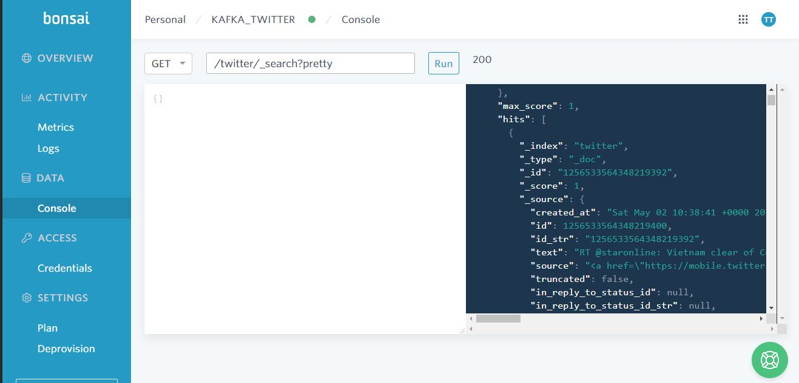

[](http://hits.dwyl.com/Thomas-George-T/Covid19-Tweet-Data-Collection)


# Covid19 Tweet Data Collection
<br>
<p align="center">
	<a href="#">
		 	
		
    	
	</a>
</p>
<br>

## Overview
Stream real time Tweets of current affairs like covid-19 using Kafka 2.0.0 high throughput producer & consumer into Elasticsearch using safe, idempotent and compression configurations. In this example, keywords like `coronavirus`, `covid-19`, `pandemic` are being used, Change them according to your requirements. Elasticsearch stores the tweets as JSON. Aggregate this data and use the data collected for further analytics.

## Breakdown
To ensure a high throughput, idempotence, safe and compression configurations are enabled with respect to **Kafka 2.0.0 version**.
In the TwitterProducer class, the variable `terms` can be updated to stream tweets about Current affairs. The prerequisite to running this project is to procure Twitter API credentials. To do this, sign up for twitter Developer account [here](https://developer.twitter.com/en/apply-for-access). After creating the app and getting the OAuth credentials,`consumerKey`,`consumerSecret`,`token`,`tokenSecret` are to be used to set the variables in `config.java`. Set these Strings to be static. Follow the below template for `config.java`

```java
public class config {
    static String consumerKey= "";
    static String consumerSecret = "";
    static String token = "";
    static String tokenSecret = "";
}
```

To integrate Twitter streaming with Kafka, we use the Horsebird Client which is a Java HTTP client for consuming Twitter's standard streaming API.

In the ElasticSearchConsumer class, We create a consumer which is subscribed to the `TwitterTopic` which is being used in the TwitterProducer class and the consumer group is `Twitter-Consumer-Group`. Google gson library is being used to parse the tweets since they are consumed in the JSON format. We extract `id_str` and use it to make our consumer idempotent and BulkRequest is used to batch before committing the offsets into Elasticsearch. After setting up ElasticSearch either on premise or on the cloud. Set `hostname`,`username`,`password` as static variables in `config.java` under the kafka-consumer-elasticsearch folder.
Follow the below template for `config.java`:

```java
public class config {
    static String hostname = ""; // Use localhost:9200 or Elasticsearch cloud URL
    static String username = ""; // Required only for Elasticsearch cloud
    static String password = ""; // Required only for Elasticsearch cloud
}
```

## Environment
- Java JDK 1.8
- [Twitter Developer Account](https://developer.twitter.com/en/apply-for-access)
- Kafka 2.0.0
- Zookeeper
- Windows/Linux
- Maven
- Elasticsearch 7.2.0 in the cloud ([bonsai](https://bonsai.io))

## Prerequisites 

Add the bin folder location of kafka to the `$PATH` 

Ensure that Zookeeper & Kafka servers are up and running *(Open in separate terminal windows if necessary)*.

Command to start Zookeeper

```
zookeeper-server-start.sh config/zookeeper.properties
```

Command to start Kafka server

```
kafka-server-start.sh config/server.properties
```

In this example, we are implementing Elasticsearch on the cloud. [bonsai](https://bonsai.io) provides a very good sandbox environment with a 3 node cluster for implementing this. 

> *Personally recommend running Elasticsearch on local machine if and only if free & available RAM >= 5 GB so as to not turn your machine into a room heater*

For the Kafka consumer to commit data into Elasticsearch, Create an index called `twitter` using the PUT command.

## Installation

After cloning this repo, Do this for both Kafka Twitter Producer and ElasticSearch consumer

1. Run the maven `clean install` command

```
mvn clean install
```

Maven will now generate a `target` directory with the jar `Kakfa-Streaming-1.0-shaded.jar` or `kafka-consumer-elasticsearch-1.0-shaded.jar` respectively

2. Move into the `target` directory

```
cd target
```

## Execution

### Executing Twitter Producer 

1. Create a `topic` called TwitterTopic. Always have a replication factor equal or lesser than the number of available brokers. *(One Time activity)*

```
kafka-topics --bootstrap-server localhost:9092 --topic TwitterTopic --create --partitions 3 --replication-factor 1
```

2. Run the kafka console consumer in another terminal window with the following `topic` and `group` parameters

```
kafka-console-consumer.sh --bootstrap-server localhost:9092 --topic TwitterTopic --group Twitter-Consumer-Group
```

3. Execute the TwitterProducer class from the shaded jar

```
java -cp Kakfa-Streaming-1.0-shaded.jar com.github.thomas.kafka.TwitterProducer
```

4. You should now be able to see the output in your Kafka console consumer terminal.

### Executing  Elasticsearch Kafka Consumer

1. Create an index in Elasticsearch called `twitter` in console or localhost using an PUT command

```
PUT /twitter
```
or 
```
curl -X PUT "localhost:9200/twitter?pretty"
```

2. Execute the ElasticSearchConsumer class from the shaded jar

```
java -cp kafka-consumer-elasticsearch-1.0-shaded.jar com.github.thomas.kafka.elasticsearchconsumer.ElasticSearchConsumer
```

3. View all the tweets in your Elasticsearch console using GET command.

```
GET /twitter/_search?pretty
```
or 
```
curl -X GET "localhost:9200/twitter/_search?pretty"
```


<br>
<br>

## Elasticsearch Cloud Result



## License

This repository is under Apache License 2.0 - see [License](LICENSE.md) for more details

## Resources

- Inspired by Stephane Maarek. Check out his [Apache Kafka Series course](https://www.udemy.com/course/apache-kafka/)
- [Twitter Horsebird Client](https://github.com/twitter/hbc)
